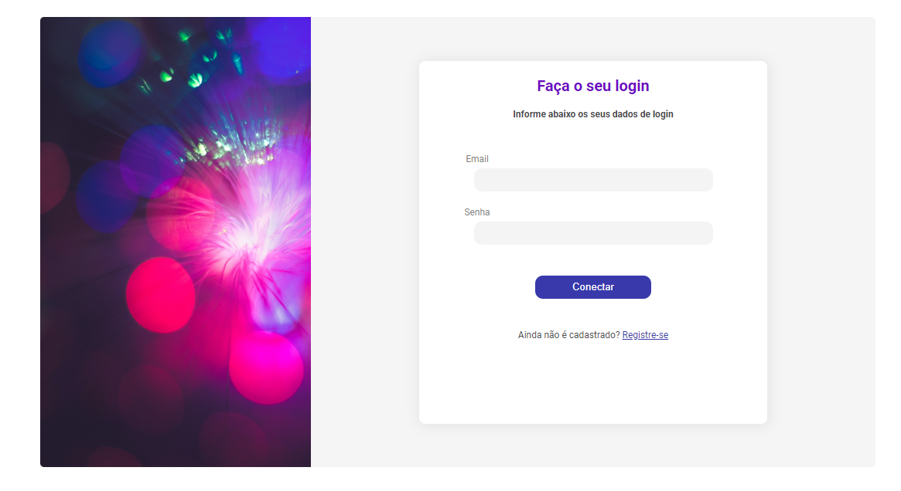

# Tela de login roxinha feita em ReactJs - Screen of login maked with ReactJs

### Screenshot

## Para baixar o projeto faça o seguinte:

** Clique no botão verde CODE e copie o link do repositório e faça um git clone ou clique em Download zip.

## Para rodar o projeto faça o seguinte:

** Depois de baixado como zip ou clonado o projeto entre na pasta do projeto e depois abra um prompt dentro dela e escreva: npm install, aguarde a instalação dos mudolos e depois rode o programa com npm run dev.

************************************

## To download the project do the following:

** Click the green CODE button and copy the repository link and do a git clone or click Download zip.

## To run the project do the following:

** After the project has been downloaded as zip or cloned, enter the project folder and then open a prompt inside it and write: npm install, wait for the modules to install and then run the program with npm run dev.